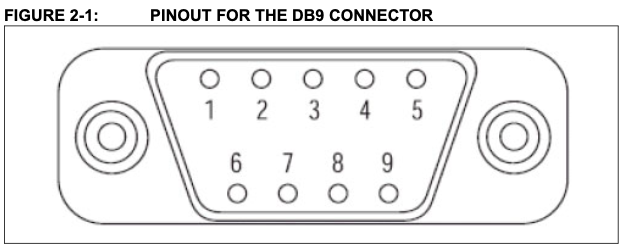
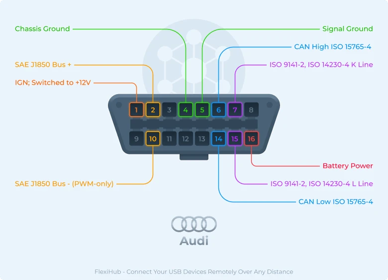

# OBD Motor Protection

## Initial setup record vehicle data
### Description
This step will allow us to record CAN data to be able to test our Arduino software on PC.

We need this material :  
- Nanopi M4 (dietpi OS)  
- Microchip CAN BUS Analyzer Tool  
- custom cable : OBDII to CAN Analyzer  


### OBDII Cable connection
**Microchip CAN Analyzer**  
<!-- {"width":315} --><!-- {"width":337} -->  

**Audi A1 side**  
 <!-- {"width":391.99999999999994} -->

**Cable connection**  

| Pin   | Microchip side | OBD side |  
| ----- | -------------- | -------- |  
| CAN_L | 2              | 14       |  
| CAN_H | 7              | 6        |  
| GND   | 6              | 5        |  

### Check connection with the vehicle
Setup the CAN interface :  
```
sudo ifconfig can0 down
sudo ip link set can0 type can termination 0 bitrate 500000
sudo ifconfig can0 up
```

### Record vehicle data
To sniff data :  
```
cansniffer can0 -c -t 0
```

Dump all CAN data into a file on the PC :  
```
candump -l can0
```  
*Note : candum-xxxx.log file will be recorded*

To read recorded data :  
```
log2asc -I candump-xxxx.log can0
```


---
## Record data

### Enable auto start in the Dietpi launcher
```
dietpi-launcher
```

Edit the script ***/var/lib/dietpi/dietpi-autostart/custom.sh*** :  
```
#!/bin/bash  
# DietPi-AutoStart custom script  
# Location: /var/lib/dietpi/dietpi-autostart/custom.sh  

# Settings
export SCRIPT_LOGGER="/mnt/usb/obd/obd-logger.sh"
export ENABLER_LOGGER="/mnt/usb/obd/auto_logger_enabler"
export LOGFILE_DIR="/mnt/usb/obd/data/"

# Name of the log file
logfile_count=$(ls -1 "$LOGFILE_DIR" | wc -l)
export LOGFILE="/mnt/usb/obd/log/odb-logger.$logfile_count.log"

# Name of the candump file
find /mnt/usb/obd/ -maxdepth 1 -name 'candump*' -exec mv {} /mnt/usb/obd/data/ \;
cd /mnt/usb/obd/data/

candump_count=`ls -1 | wc -l`
for file in candump-*.log; do
		new_name="${candump_count}-candump.log"
		mv "$file" "$new_name"
		candump_count=$(($candump_count + 1))
done
cd -

# Main loop
while true
do
	if ([ -f "$SCRIPT_LOGGER" ] && [ -f "$ENABLER_LOGGER" ]); then
		exec > >(tee -a "$LOGFILE") 2>&1
		$SCRIPT_LOGGER
		break
	else
		sleep 1
	fi
done

exit 0
```

### Prepare USB Stick
On usb stick, into a **obd** folder, create these scripts :  
- obd-setup.sh  
```
# CAN interface
echo "waiting for CAN interface..."
while true
do
  if [ ! -z "$(ifconfig -a | grep 'can0')"  ]; then
    break
  else
    sleep 1
  fi
done

echo "configuring CAN interface..."
sudo ifconfig can0 down
sleep 1
sudo ip link set can0 type can termination 0 bitrate 500000
sudo ifconfig can0 up
sudo ip -details link show can0
sleep 1
```

- bod-logger.sh  
```
clear
echo "starting script..."

export CMD_SEND="cansend can0"
export CFG_DELAY="0.05"

export requests=(
			"7DF#020104AAAAAAAAAA"		# Calculated engine load
		 	"7DF#020106AAAAAAAAAA"		# Short term fuel trim (bank 1)
		 	"7E0#0322128C00000000"		# Injection time
		 	)

# CAN interface setup
cd $(dirname "$0")
./obd-setup.sh

# Start dumping data
candump can0 -t a -l

# Message request loop
#while true
#do
#  for i in "${requests[@]}"
#  do
#    $CMD_SEND $i
#    sleep $CFG_DELAY
#  done
#done

echo "done"
```

By this way, if you plug the ***usb stick*** AND create a ***auto_logger_enabled*** file, it will start logger.


---
## Development of the Arduino software
### Description
Now that we have recorded data, we will able to test the software in a simulated environment.

We need this material :  
- PC with Linux  
- Microchip CAN BUS Analyzer Tool  
- custom cable : CAN Analyzer to DB9 Arduino  
- Arduino IDE  
- Arduino setup  
- Power supply  


### Arduino schematic
<!-- {"width":455} -->

### Replay data
First, it’s important to enable termination resistor on CANBUS Analyzer and by plugged the J11 jumper on the Arduino CAN board.

To simulate vehicle data, we will replay data that we have previously recorded :  
```
canplayer vcan0=can1 -v -I candump-xxxx.log
```  

*Note : use the expressionCANinterfaceToUse=CANinterfaceInFile*


---
## Final setup
### Schematic


---
## OBD CAN frame format
```
XXX#YYZZUUAAAAAAAAAA
```

where :  
- **XXX** : 7DF for a request, 7E8 when ECU send response  
- **YY** : data size  
- **ZZ** : OBD mode  
- **UU** : PID (could more than 2 Bytes, it’s just for example)  
- **AA**… : AA to complete frame  

## UDS CAN frame format
```
XXX#YYZZUUAAAAAAAAAA
```

where :  
- **XXX** : 7E0 for a request, 7E8 when ECU send response  
- **YY** : data size  
- **ZZ** : UDS Request SID (send) or UDS Response SID (receive)  
- **UU** : PID (could more than 2 Bytes, it’s just for example )  
- **AA**… : 00 to complete frame


---
## Links
- OBD PID : [link](https://en.wikipedia.org/wiki/OBD-II_PIDs)
- UDS : [link](https://en.wikipedia.org/wiki/Unified_Diagnostic_Services)
- CAN tools manual : [link](https://sgframework.readthedocs.io/en/latest/cantutorial.html)
- Frame tool : [link](https://www.csselectronics.com/pages/obd2-pid-table-on-board-diagnostics-j1979)

---
## Documents
[CAN-Bus-Analyzer-Users-Guide-DS50001848C.pdf](README/CAN-Bus-Analyzer-Users-Guide-DS50001848C.pdf)<!-- {"width":180,"embed":"true","preview":"true"} -->
